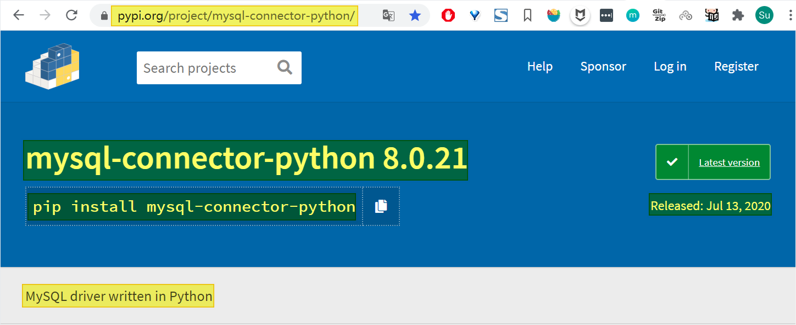

# <center>Python通过MySQL Connector/Python驱动接口操作MySQL</center>


# 0. 前言

Python可以通过很多种方式来访问操作MySQL数据库，较为常见的方式有如下6种：

- 通过`MySQL Connector/Python`驱动接口
- 通过`PyMySQL`驱动接口
- 通过`MySQLdb`驱动接口
- 通过`SQLAlchemy-Raw-SQL`
- 通过`SQLAlchemy-SQL-Expression`
- 通过`SQLAlchemy-ORM`

本文对其中的第一种方式——***“Python通过`MySQL Connector/Python`驱动接口访问操作MySQL数据库***” 进行介绍。


> 本文以Windows平台上开发为例进行讲解，相关基本开发环境如下：
>
> -  Windows 7 （64位）
> -  MySQL v8.0.21
> -  Python v3.8.5
> -  Connector/Python v8.0.21
> - Visual Studio Code v1.47.3 （可选项，用来对Python代码进行编辑调试）


---

# 1.  MySQL Connector/Python 介绍

## 1.1 Connector/Python简介

`MySQL Connector/Python`是MySQL官方提供的一种Python语言编写的可以使Python连接到MySQL的驱动接口。通过`MySQL Connector/Python`驱动接口，Python程序就可以使用符合[Python数据库API规范v2.0（PEP 249）](http://www.python.org/dev/peps/pep-0249/)的API来方便的访问MySQL数据库 了。

`MySQL Connector/Python`项目：https://pypi.org/project/mysql-connector-python/

`MySQL Connector/Python`文档：https://dev.mysql.com/doc/connector-python/en/

`MySQL Connector/Python`版本：8.0.21（2020年7月13日）



**`MySQL Connector/Python` 8.0版本包括如下特性：**

(1) 支持MySQL Server（5.5、5.6、5.7、8.0版本） 所提供的几乎所有功能

(2) 支持 `X DevAPI`

(3) 支持 Python 和 MySQL 参数的数据类型之间的双向转换（例如 Python 的 `datetime` 和 MySQL 的 `DATETIME`）

(4) 支持MySQL对标准SQL语法的所有扩展

(5) 支持协议压缩，可以压缩客户端和服务器之间的数据流

(6) 支持使用TCP/IP套接字建立连接

(7) 支持使用SSL 建立安全的 TCP/IP 连接

(8) 自包含驱动程序，这使得`MySQL Connector/Python` 在 Python 标准库之外，不再需要MySQL客户端库或任何Python模块


---

## 1.2 Connector/Python版本

`Connector/Python` 8.0版本 与 `MySQL Server` 和 `Python` 各版本之间的支持如下表：

| Connector/Python<br />Version |   MySQL Server<br/>Versions   |    Python <br />Versions     |         Connector Status         |
| :---------------------------: | :---------------------------: | :--------------------------: | :------------------------------: |
|              8.0              |      8.0、5.7、5.6、5.5       | 3.8、3.7、3.6、3.5、3.4、2.7 |       General Availability       |
| 2.2<br /> (continues as 8.0)  |         5.7, 5.6, 5.5         |        3.5, 3.4, 2.7         | Developer Milestone, No releases |
|              2.1              |         5.7, 5.6, 5.5         |      3.5, 3.4, 2.7, 2.6      |       General Availability       |
|              2.0              |         5.7, 5.6, 5.5         |      3.5, 3.4, 2.7, 2.6      | GA, final release on 2016-10-26  |
|              1.2              | 5.7, 5.6, 5.5 (5.1, 5.0, 4.1) | 3.4, 3.3, 3.2, 3.1, 2.7, 2.6 | GA, final release on 2014-08-22  |


---

# 2 MySQL Connector/Python 安装

## 2.1 MySQL下载安装

**一、MySQL下载**

可从MySQL官方下载网址[https://dev.mysql.com/downloads/installer/]上找到安装包。


> 注：这里选择64位Windows平台对应的最新MySQL Community版本安装文件：`mysql-installer-community-8.0.21.0.msi`。

**二、MySQL安装**

执行`mysql-installer-community-8.0.21.0.msi`安装文件，根据提示完成MySQL安装。

**三、MySQL账户权限设置**

```mysql
# 创建账户myuser，密码：mypasswd
mysql> CREATE USER 'myuser'@'127.0.0.1' IDENTIFIED BY 'mypasswd';

# 授予账户buaajs权限：
mysql> GRANT SELECT,INSERT,UPDATE,DELETE,CREATE,DROP,ALTER ON *.* TO 'myuser'@'127.0.0.1';
# 或
# 授予账户myuser所有权限：
mysql> GRANT ALL PRIVILEGES ON *.* TO 'myuser'@'127.0.0.1';

# 查看账户myuser权限：
mysql> show grants for 'myuser'@'127.0.0.1';
```


---

## 2.2 Python下载安装

**一、Python下载**

可从Python官方下载网址[https://www.python.org/downloads/]上找到安装包。


> 注：这里选择64位Windows平台对应的最新版本的Python安装文件：`python-3.8.5-amd64.exe`。

**二、Python安装**

执行`python-3.8.5-amd64.exe`安装文件，根据提示完成Python安装。

> 注：在Windows上安装Python时，请务必在安装过程中启用`将python.exe添加到Path` 。


---

## 2.3 MySQL Connector/Python下载安装

Windows上可以通过以下两种方法完成 `MySQL Connector/Python`的安装：

**一、方法1：通过下载msi安装程序文件然后安装**

1、下载msi安装程序

可从`MySQL Connector/Python`官方下载网址[https://dev.mysql.com/downloads/connector/python/]上找到安装包。


> 注：这里选择64位Windows平台对应的最新版本的msi安装文件：`mysql-connector-python-8.0.21-windows-x86-64bit.msi `。

2、执行安装

执行`mysql-connector-python-8.0.21-windows-x86-64bit.msi`安装文件，根据提示完成`MySQL Connector/Python`安装。


**二、方法2：直接通过`pip`命令来完成下载安装。**

```powershell
# 使用pip命令安装mysql-connector-python:
PS C:\> pip install mysql-connector-python
Requirement already satisfied: mysql-connector-python in c:\develop\python\lib\site-packages (8.0.21)
Requirement already satisfied: protobuf>=3.0.0 in c:\develop\python\lib\site-packages (from mysql-connector-python) (3.6.1)
Requirement already satisfied: six>=1.9 in c:\users\jiangsu\appdata\roaming\python\python38\site-packages (from protobuf>=3.0.0->mysql-connector-python) (1.12.0)
Requirement already satisfied: setuptools in c:\develop\python\lib\site-packages (from protobuf>=3.0.0->mysql-connector-python) (47.1.0)
```

> 注：在Windows上，`Connector/Python`的默认安装位置为：`{python安装路径}\Lib\site-packages`。如本机Python安装在`C:\Develop\Python`目录下，则`Connector/Python`安装在`C:\Develop\Python\Lib\site-packages`目录下。
>


**三、安装验证**

```powershell
# 使用以下命令来验证mysql-connector是否安装成功：
PS C:\> python
Python 3.8.5 (tags/v3.8.5:580fbb0, Jul 20 2020, 15:57:54) [MSC v.1924 64 bit (AMD64)] on win32
Type "help", "copyright", "credits" or "license" for more information.
>>>
>>> import mysql.connector
>>>
# 执行以上代码，如果没有产生错误，表明安装成功。
```


**四、确定`Connector/Python`安装位置**

在Windows上，`Connector/Python`的默认安装位置为：`{python安装路径}\Lib\site-packages`，可以通过如下命令来进行确定其位置：

```powershell
PS C:\> python
Python 3.8.5 (tags/v3.8.5:580fbb0, Jul 20 2020, 15:57:54) [MSC v.1924 64 bit (AMD64)] on win32
Type "help", "copyright", "credits" or "license" for more information.
>>>
>>> from distutils.sysconfig import get_python_lib
>>>
>>> print(get_python_lib())
C:\Develop\Python\Lib\site-packages
>>>
```

> 注：本机Python安装在`C:\Develop\Python`目录下，则`Connector/Python`安装在`C:\Develop\Python\Lib\site-packages`目录下。


# 3. 实现方式介绍

## 3.1 执行流程

**Python通过`MySQL Connector/Python`驱动接口访问操作MySQL数据库**的主要执行流程如下：

– (1) 导入`MySQL Connector/Python`模块（`mysql.connector`）

– (2) 建立与MySQL的连接

– (3) 创建游标对象

– (4) 定义SQL语句

– (5) 执行SQL语句

– (6) 提交/回滚事务

– (7) 关闭游标和连接


---

## 3.2 主要实现要点

**Python通过`MySQL Connector/Python`驱动接口访问操作MySQL数据库**的主要实现要点如下：

---

### 3.2.1 导入MySQL Connector/Python模块

在Python中要使用`MySQL Connector/Python`驱动接口，则需要导入`mysql.connectot`模块：

```python
import mysql.connectot
```


---

### 3.2.2 建立与MySQL的连接

**一、连接方式**

`MySQL Connector/Python`支持两种方式建立与`MySQL Server`的连接：

- **方式一：通过`mysql.connector.connect()`构造函数**

通过`connect()`构造函数创建到MySQL服务器的连接，并返回一个 `MySQLConnection`对象。

```python
# 创建连接对象myconn
myconn = mysql.connector.connect(
	user="myuser", passwd="mypasswd", database="mydb")
```

- **方式二：通过`mysql.connector.MySQLConnection()`类**

可以通过`connect()`构造函数创建到MySQL服务器的连接，并返回一个 `MySQLConnection`对象。

```python
# 创建连接对象myconn
myconn = mysql.connector.MySQLConnection(
	user="myuser", passwd="mypasswd", database="mydb")
```
这两种方式都是有效的，实现的功能也相同。本文示例首选第一种方式（使用`connect()`构造函数）。

----

**二、连接参数的另外一种定义及使用**

可以先通过在字典变量中定义连接参数，然后建立连接时通过 `**`运算符来加载参数。

```python
# 定义连接参数变量
config = {
  'user': 'myuser',
  'password': 'mypasswd',
  'database': 'mydb',
  'host': '127.0.0.1'
}
# 建立连接（通过连接参数变量），并返回一个连接对象myconn
myconn = mysql.connector.connect(**config)
```

详细的连接参数请参见【附件1-Connector/Python Connection Arguments】

---

**三、实现方式**

`MySQL Connector/Python`通过连接参数`use_pure`的两种配置选项提供了两种实现方式：

- **方式一：使用纯Python接口实现方式**，此时`use_pure=True`
- **方式二：使用MySQL C客户端库的C扩展实现方式**，此时`use_pure=False`

在MySQL早期版本中连接参数`use_pure`缺省设置为`True`；从MySQL 8.0.11版本开始连接参数`use_pure`缺省设置为`False`。

当在连接参数`use_pure`中设置了`False`时，如果系统上C扩展可使用，则`MySQL Connector/Python`可以使用MySQL C客户端库的C扩展实现方式。但如果系统上C扩展不可用，则`MySQL Connector/Python`将自动退回到纯Python实现方式。

**示例代码如下（使用C扩展）：**

```python
# 建立连接（使用C扩展实现方式）
myconn = mysql.connector.MySQLConnection(
	user="myuser", passwd="mypasswd", database="mydb",
	use_pure=False)
```


----

### 3.2.3 创建游标对象

在建立了一个连接对象`myconn`后，可以使用连接对象`myconn`的 [`cursor()`](https://dev.mysql.com/doc/connector-python/en/connector-python-api-mysqlconnection-cursor.html) 方法来创建一个新的游标（缺省情况下是一个`MySQLCursor`对象）。

```python
mycursor = myconn.cursor()
```

> 注：一个连接可以建立多个游标。


---

### 3.2.4 定义SQL语句

可以将SQL语句存储在变量中。可以存储在一个变量中；也可以将SQL语句分成存储在两个变量中：其中第一个变量是字符串类型，存储基本操作命令语句（将相关数据用`%s`来代替），第二个变量是元组` tuple `或字典`dictionary`类型，存储用来替换第一个变量中的`%s`对应的数据信息。

**示例代码如下：**

```python
# 定义数据库名、数据表名（全局变量）
DB_NAME = “mydb”
TABLE_NAME = “mytable”

# 定义SQL语句（创建数据库）
sql_db_create = "CREATE DATABASE IF NOT EXISTS {} \
	DEFAULT CHARSET utf8 COLLATE utf8_general_ci;".format(DB_NAME)

#----------------------------------------------------------------
# 定义SQL语句（删除数据库）
sql_db_drop = "DROP DATABASE mydb;"

#----------------------------------------------------------------
# 定义SQL语句（创建数据表）
sql_table_create = "CREATE TABLE IF NOT EXISTS {} (\
        id INT NOT NULL AUTO_INCREMENT PRIMARY KEY,\
        name VARCHAR(40) NOT NULL,\
        url VARCHAR(80) NOT NULL)".format(TABLE_NAME)

#----------------------------------------------------------------
# 定义SQL语句（删除数据表）
sql_table_drop = "DROP TABLE IF EXISTS mytable"

#----------------------------------------------------------------
# 定义SQL语句（插入数据记录）
sql_insert = "INSERT INTO {} (name, url) \
			  VALUES (%s, %s)".format(TABLE_NAME)
data_insert1 = ("MySQL", "https://www.mysql.com")
data_inaert2 = [('Google', 'https://www.google.com'),
         	    ('GitHub', 'https://www.github.com'),
         	    ('Baidu', 'https://www.baidu.com')]

#----------------------------------------------------------------
# 定义SQL语句（删除数据记录）
sql_delete = "DELETE FROM {} WHERE name = %s".format(TABLE_NAME)
data_delete = ("Baidu",)

#----------------------------------------------------------------
# 定义SQL语句（更新数据记录）
sql_update = "UPDATE {} set name = %s, url = %s \
			  WHERE name = %s".format(TABLE_NAME)
data_update = ("Python", "https://www.python.org", "GitHub")

#----------------------------------------------------------------
# 定义SQL语句（查询数据记录）
sql_query = "SELECT * FROM {}".format(TABLE_NAME)
data_query = ()
```


---

### 3.2.5 执行SQL语句

所有DDL（数据定义语言）语句都是使用称为游标的句柄结构执行的。``MySQLCursor`对象有两个执行SQL语句的方法。

在执行SQL语句后，MySQL服务器已准备好发送数据。结果集可以是零行，一行或很多行。根据预期的数量，可以使用不同的技术来处理此结果集。可以将 `cursor`对象用作迭代器。

#### 3.2.5.1 MySQLCursor.execute()方法

**一、语法Syntax:**

```python
mycursor.execute(operation, params=None, multi=False)
iterator = mycursor.execute(operation, params=None, multi=True)
```

**二、说明：**

`execute()`方法执行给定参数的SQL语句（==数据值根据需要从Python对象转换为MySQL可以理解的值==）：

- 参数`operation`：是字符串变量，是数据库`operation`语句（查询或其他操作命令），可以使用`%s`指定相关变量。
- 参数`params`：是元组` tuple `或字典`dictionary`类型变量，参数`params`中各个参数绑定到参数`operation`中的对应变量`%s`；如果没有则设为`None`。
- 参数`multi`：是布尔类型，取值：`True`或`False`
- 返回值：如果参数`multi=True`，则`execute()`方法返回一个迭代器`iterator`。

> 注意：==在Python中，包含单个值的元组`tuple`必须包含逗号`,`。==
>
> 例如，`('abc')`被评估为一个`scalar`，而`('abc',)`被评估为一个元组`tuple`。

**三、插入单条记录的示例代码：**

```python
# 插入单条记录的示例代码：
sql_insert = "INSERT INTO mytable (name, url) VALUES (%s, %s)"
data_insert = ("MySQL", "https://www.mysql.com")
mycursor.execute(sql_insert, data_inaert)
```

---

如果参数`multi`设置为`True`， 则`execute()`方法可以执行在`operation`字符串中指定的多个SQL语句。它返回一个可以处理每个语句的结果的迭代器。

> 建议：一般情况最好单独执行每个SQL语句。

下面的示例在单个`execute()`操作中查询参数`operation`中指定的2个SQL语句， 并显示每个语句的结果：

```python
operation = "SELECT * FROM mytable WHERE (id>2);SELECT * FROM mytable WHERE (id<=2);"
for myresult in mycursor.execute(operation, multi=True):
    if myresult.with_rows:
        print("由语句'{}'生成的行记录为:".format(myresult.statement))
        print(myresult.fetchall())
    else:
        print("受语句'{}'影响的行数为: {}".format(myresult.statement, myresult.rowcount))
```


#### 3.2.5.2 MySQLCursor.executemany()方法

**一、语法Syntax:**

```python
mycursor.executemany(operation, seq_of_params)
```

**二、说明：**

`executemany()`方法在执行SQL语句时使用多行语法对参数序列给定的数据值进行批处理。

- 参数`operation`：是字符串变量，是数据库`operation`语句（查询或其他操作命令），可以使用`%s`指定相关变量。
- 参数`seq_of_params`：是元组` tuple `类型变量，表示可以替代参数`operation`中`%s`的参数序列。

> 注意：==在Python中，包含单个值的元组`tuple`必须包含逗号`,`。==
>
> 例如，`('abc')`被评估为一个`scalar`，而`('abc',)`被评估为一个元组`tuple`。

在大多数情况下，`executemany()`方法遍历参数序列时，每次都会将当前参数传递给`execute()`方法。

---

**插入三条记录的示例代码：**

```python
sql_insert = "INSERT INTO mytable (name, url) VALUES (%s, %s)"
data_inaert = [('Google', 'https://www.google.com'),
         	   ('GitHub', 'https://www.github.com'),
         	   ('Baidu', 'https://www.baidu.com')]
mycursor.executemany(sql_insert, data_inaert)
```

对于上面的示例发送给MySQL的插入语句为：

```sql
INSERT INTO mytable (name, url)
VALUES ('Google', 'https://www.google.com'), ('GitHub', 'https://www.github.com'), ('Baidu', 'https://www.baidu.com')
```

> 使用`executemany()`方法时，不能在`operation`参数中指定要执行的多个语句 。否则会引发 `InternalError`异常。可以考虑改为使用 带 参数`multi=True`的`execute()`方法。


---

### 3.2.6 提交事务/回滚事务

在MySQL 5.5及更高版本中默认使用事务性存储引擎`InnoDB`，故在执行 `INSERT`、`DELETE`和`UPDATE`语句后必须提交相关数据。

由于`MySQL Connnector/Python`默认关闭自动提交事务功能，因此针对“**增删改操作**”需要使用连接的`commit()`方法来提交当前的更改。当然也可以在提交事务之前，使用连接的`rollback()`方法来回滚当前的更改。

**示例代码如下：**

```python
# 提交当前事务
myconn.commit()

# 回滚当前事务
myconn.rollback()       
```


---

### 3.2.7 关闭游标和连接

当应用程序不再需要进行DDL操作时，建议关闭之前创建的游标；

当应用程序不再需要连接MySQL或退出时，需要关闭之前创建的连接。

**示例代码如下：**

```python
# 关闭游标
mycursor.close()

# 关闭连接
myconn.close()       
```


----

# 4. 示例代码

下面针对Python通过`MySQL Connector/Python`访问MySQL数据库常见的操作（如：连接数据库、创建数据库、删除数据库、创建数据表、删除数据表、插入数据记录、删除数据记录、修改数据记录、查询数据记录等）分别给出一个较为完整的入门示例（含详细代码注释）。

+++++++++++++++++++++++++++++++++++++++++++++++++++++++++++++++++++++++++++++++

## 4.1 创建数据库连接示例

```python
# 文件名：01_Connector_Create_Connect.py
# 功能说明：通过MySQL Connector/Python驱动接口创建与MySQL Server的连接

#-------------------------------------------------------------------------
# 一、导入MySQL Connector/Python模块中相关的部分
#-------------------------------------------------------------------------
import mysql.connector
from mysql.connector import errorcode

#-------------------------------------------------------------------------
# 二、建立与MySQL的连接
#-------------------------------------------------------------------------
try:
	# 创建连接对象myconn
    myconn = mysql.connector.connect(
		user="myuser",
	    passwd="mypasswd",
		host="127.0.0.1"
		)
    print("连接MySQL Server成功！")
except mysql.connector.Error as err:
    # 如果连接失败，则给出连接失败相应提示
    if err.errno == errorcode.ER_ACCESS_DENIED_ERROR:
        print("连接MySQL Server失败!————用户名或密码有误")
    else:
        print('连接MySQL Server失败!————{}'.format(err))
finally:    # 关闭连接myconn
    myconn.close()
```


## 4.2 创建数据库示例

```python
# 文件名：02_Connector_Create_Database.py
# 功能说明：通过MySQL Connector/Python驱动接口创建MySQL数据库

#-------------------------------------------------------------------------
# 一、导入MySQL Connector/Python模块中相关的部分
#-------------------------------------------------------------------------
import mysql.connector
from mysql.connector import errorcode

#-------------------------------------------------------------------------
# 二、建立与MySQL的连接
#-------------------------------------------------------------------------
# 数据库名
DB_NAME = 'mydb'
try:
	# 创建连接对象myconn
    myconn = mysql.connector.connect(
		user="myuser",
	    passwd="mypasswd",
		host="127.0.0.1",
        charset='utf8mb4'
		)
    print("连接MySQL Server成功！")
except mysql.connector.Error as err:
    # 如果连接失败，则给出连接失败相应提示
    if err.errno == errorcode.ER_ACCESS_DENIED_ERROR:
        print("连接MySQL Server失败!————用户名或密码有误")
    else:
        print('连接MySQL Server失败!————{}'.format(err))

#-------------------------------------------------------------------------
# 三、创建游标对象
#-------------------------------------------------------------------------
mycursor = myconn.cursor()

#-------------------------------------------------------------------------
# 四、定义SQL语句（创建数据库）
#-------------------------------------------------------------------------
# SQL语句（创建数据库）：如果数据库不存在则创建，存在则不创建; 
sql_str = "CREATE DATABASE IF NOT EXISTS {} DEFAULT CHARSET utf8 COLLATE utf8_general_ci;".format(DB_NAME)

#-------------------------------------------------------------------------
# 五、执行SQL语句
#-------------------------------------------------------------------------
try:
    mycursor.execute(sql_str)  
    # 提交数据库执行SQL语句
    myconn.commit()             
    print('创建数据库{}成功！'.format(DB_NAME))
except:	# 如果发生错误则回滚
    myconn.rollback()           
    print('创建数据库{}失败！'.format(DB_NAME))
finally:    # 关闭游标mycursor和连接myconn
    mycursor.close()
    myconn.close()
```


## 4.3 删除数据库示例

```python
# 文件名：03_Connector_Drop_Database.py
# 功能说明：通过MySQL Connector/Python驱动接口删除MySQL数据库

#-------------------------------------------------------------------------
# 一、导入MySQL Connector/Python模块中相关的部分
#-------------------------------------------------------------------------
import mysql.connector
from mysql.connector import errorcode

#-------------------------------------------------------------------------
# 二、建立与MySQL的连接
#-------------------------------------------------------------------------
# 数据库名
DB_NAME = 'mydb'
try:
	# 创建连接对象myconn
    myconn = mysql.connector.connect(
		user="myuser",
	    passwd="mypasswd",
		host="127.0.0.1",
        charset='utf8mb4'
		)
    print("连接MySQL Server成功！")
except mysql.connector.Error as err:
    # 如果连接失败，则给出连接失败相应提示
    if err.errno == errorcode.ER_ACCESS_DENIED_ERROR:
        print("连接MySQL Server失败!————用户名或密码有误")
    else:
        print('连接MySQL Server失败!————{}'.format(err))

#-------------------------------------------------------------------------
# 三、创建游标对象
#-------------------------------------------------------------------------
mycursor = myconn.cursor()

#-------------------------------------------------------------------------
# 四、定义SQL语句（删除数据库）
#-------------------------------------------------------------------------
sql_str = "DROP DATABASE {};".format(DB_NAME)

#-------------------------------------------------------------------------
# 五、执行SQL语句
#-------------------------------------------------------------------------
try:
    mycursor.execute(sql_str)  
    # 提交数据库执行SQL语句
    myconn.commit()             
    print('删除数据库{}成功！'.format(DB_NAME))
except:	# 如果发生错误则回滚
    myconn.rollback()           
    print('删除数据库{}失败！'.format(DB_NAME))
finally:    # 关闭游标mycursor和连接myconn
    mycursor.close()
    myconn.close()
```


## 4.4 创建数据表示例

```python
# 文件名：04_Connector_Create_Table.py
# 功能说明：通过MySQL Connector/Python驱动接口创建数据库中的数据表

#-------------------------------------------------------------------------
# 一、导入MySQL Connector/Python模块中相关的部分
#-------------------------------------------------------------------------
import mysql.connector
from mysql.connector import errorcode

#-------------------------------------------------------------------------
# 二、建立与MySQL的连接
#-------------------------------------------------------------------------
# 定义数据库名和数据表名
DB_NAME = 'mydb'
TABLE_NAME = 'mytable'
try:
	# 创建连接对象myconn
    myconn = mysql.connector.connect(
		user="myuser",
	    passwd="mypasswd",
        database=DB_NAME,
		host="127.0.0.1",
        charset='utf8mb4'
		)
    print('连接数据库{}成功！'.format(DB_NAME))
except mysql.connector.Error as err:
    # 如果连接失败，则给出连接失败相应提示
    if err.errno == errorcode.ER_ACCESS_DENIED_ERROR:
        print('连接数据库{}失败!————用户名或密码有误'.format(DB_NAME))
    elif err.errno == errorcode.ER_BAD_DB_ERROR:
        print('连接数据库{}失败!————数据库不存在'.format(DB_NAME))
    else:
        print('连接数据库{}失败!————{}'.format(DB_NAME, err))

#-------------------------------------------------------------------------
# 三、创建游标对象
#-------------------------------------------------------------------------
mycursor = myconn.cursor()

#-------------------------------------------------------------------------
# 四、定义SQL语句（创建数据表）
#-------------------------------------------------------------------------
sql_table_create = "CREATE TABLE IF NOT EXISTS {} (\
        id INT NOT NULL AUTO_INCREMENT PRIMARY KEY,\
        name VARCHAR(40) NOT NULL,\
        url VARCHAR(80) NOT NULL)".format(TABLE_NAME)

#-------------------------------------------------------------------------
# 五、执行SQL语句
#-------------------------------------------------------------------------
try:
    mycursor.execute(sql_table_create)  
    # 提交数据库执行SQL语句
    myconn.commit()             
    print('创建数据表{}成功！'.format(TABLE_NAME))
except:	# 如果发生错误则回滚
    myconn.rollback()           
    print('创建数据表{}失败！'.format(TABLE_NAME))
finally:    # 关闭游标mycursor和连接myconn
    mycursor.close()
    myconn.close()
```

**主键设置**

+++++++++++++++++++++++++++++++++++++++++++++++++++++++++++++++++++++++++++++++

创建表的时候一般都会设置一个主键（PRIMARY KEY），使用 "INT AUTO_INCREMENT PRIMARY KEY" 语句来创建一个主键，主键起始值为 1，逐步递增。
如果的表已经创建，需要使用 ALTER TABLE 来给表添加主键：

```mysql
sql_str = "ALTER TABLE mytable ADD COLUMN id INT AUTO_INCREMENT PRIMARY KEY"
mycursor.execute(sql_str)
```


## 4.5 删除数据表示例

```python
# 文件名：05_Connector_Drop_Table.py
# 功能说明：通过MySQL Connector/Python驱动接口删除数据库中的数据表

#-------------------------------------------------------------------------
# 一、导入MySQL Connector/Python模块中相关的部分
#-------------------------------------------------------------------------
import mysql.connector
from mysql.connector import errorcode

#-------------------------------------------------------------------------
# 二、建立与MySQL的连接
#-------------------------------------------------------------------------
# 定义数据库名和数据表名
DB_NAME = 'mydb'
TABLE_NAME = 'mytable'
try:
	# 创建连接对象myconn
    myconn = mysql.connector.connect(
		user="myuser",
	    passwd="mypasswd",
        database=DB_NAME,
		host="127.0.0.1",
        charset='utf8mb4'
		)
    print('连接数据库{}成功！'.format(DB_NAME))
except mysql.connector.Error as err:
    # 如果连接失败，则给出连接失败相应提示
    if err.errno == errorcode.ER_ACCESS_DENIED_ERROR:
        print('连接数据库{}失败!————用户名或密码有误'.format(DB_NAME))
    elif err.errno == errorcode.ER_BAD_DB_ERROR:
        print('连接数据库{}失败!————数据库不存在'.format(DB_NAME))
    else:
        print('连接数据库{}失败!————{}'.format(DB_NAME, err))

#-------------------------------------------------------------------------
# 三、创建游标对象
#-------------------------------------------------------------------------
mycursor = myconn.cursor()

#-------------------------------------------------------------------------
# 四、定义SQL语句（删除数据表）
#-------------------------------------------------------------------------
sql_str = "DROP TABLE IF EXISTS {}".format(TABLE_NAME)

#-------------------------------------------------------------------------
# 五、执行SQL语句
#-------------------------------------------------------------------------
try:
    mycursor.execute(sql_str)  
    # 提交数据库执行SQL语句
    myconn.commit()             
    print('删除数据表{}成功！'.format(TABLE_NAME))
except:	# 如果发生错误则回滚
    myconn.rollback()           
    print('删除数据表{}失败！'.format(TABLE_NAME))
finally:    # 关闭游标mycursor和连接myconn
    mycursor.close()
    myconn.close()
```


## 4.6 插入单条数据记录示例

```python
# 文件名：06_Connector_Insert_Data.py
# 功能说明：通过MySQL Connector/Python驱动接口插入数据库中的数据表的数据记录

#-------------------------------------------------------------------------
# 一、导入MySQL Connector/Python模块中相关的部分
#-------------------------------------------------------------------------
import mysql.connector
from mysql.connector import errorcode

#-------------------------------------------------------------------------
# 二、建立与MySQL的连接
#-------------------------------------------------------------------------
# 定义数据库名和数据表名
DB_NAME = 'mydb'
TABLE_NAME = 'mytable'
try:
	# 创建连接对象myconn
    myconn = mysql.connector.connect(
		user="myuser",
	    passwd="mypasswd",
        db=DB_NAME,
		host="127.0.0.1",
        charset='utf8mb4'
		)
    print('连接数据库{}成功！'.format(DB_NAME))
except mysql.connector.Error as err:
    # 如果连接失败，则给出连接失败相应提示
    if err.errno == errorcode.ER_ACCESS_DENIED_ERROR:
        print('连接数据库{}失败!————用户名或密码有误'.format(DB_NAME))
    elif err.errno == errorcode.ER_BAD_DB_ERROR:
        print('连接数据库{}失败!————数据库不存在'.format(DB_NAME))
    else:
        print('连接数据库{}失败!————{}'.format(DB_NAME, err))

#-------------------------------------------------------------------------
# 三、创建游标对象
#-------------------------------------------------------------------------
mycursor = myconn.cursor()

#-------------------------------------------------------------------------
# 四、定义SQL语句（插入数据记录）
#-------------------------------------------------------------------------
sql_str = "INSERT INTO {} (name, url) VALUES (%s, %s)".format(TABLE_NAME)
# 记录变量
myval = ("MySQL", "https://www.mysql.com")

#-------------------------------------------------------------------------
# 五、执行SQL语句
#-------------------------------------------------------------------------
try:
    mycursor.execute(sql_str, myval)  
    # 提交数据库执行SQL语句
    myconn.commit()             
    print('向数据表{}中成功插入'.format(TABLE_NAME), mycursor.rowcount, '条数据记录！')
except:	# 如果发生错误则回滚
    myconn.rollback()           
    print('向数据表{}中插入数据记录失败！'.format(TABLE_NAME))
finally:    # 关闭游标mycursor和连接myconn
    mycursor.close()
    myconn.close()
```


## 4.7 插入多条数据记录示例

```mysql
# 文件名：07_Connector_Batch_Insert_Data.py
# 功能说明：通过MySQL Connector/Python驱动接口批量插入数据库中的数据表的数据记录

#-------------------------------------------------------------------------
# 一、导入MySQL Connector/Python模块中相关的部分
#-------------------------------------------------------------------------
import mysql.connector
from mysql.connector import errorcode

#-------------------------------------------------------------------------
# 二、建立与MySQL的连接
#-------------------------------------------------------------------------
# 定义数据库名和数据表名
DB_NAME = 'mydb'
TABLE_NAME = 'mytable'
try:
	# 创建连接对象myconn
    myconn = mysql.connector.connect(
		user="myuser",
	    passwd="mypasswd",
        database=DB_NAME,
		host="127.0.0.1",
        charset='utf8mb4'
		)
    print('连接数据库{}成功！'.format(DB_NAME))
except mysql.connector.Error as err:
    # 如果连接失败，则给出连接失败相应提示
    if err.errno == errorcode.ER_ACCESS_DENIED_ERROR:
        print('连接数据库{}失败!————用户名或密码有误'.format(DB_NAME))
    elif err.errno == errorcode.ER_BAD_DB_ERROR:
        print('连接数据库{}失败!————数据库不存在'.format(DB_NAME))
    else:
        print('连接数据库{}失败!————{}'.format(DB_NAME, err))

#-------------------------------------------------------------------------
# 三、创建游标对象
#-------------------------------------------------------------------------
mycursor = myconn.cursor()

#-------------------------------------------------------------------------
# 四、定义SQL语句（插入数据记录）
#-------------------------------------------------------------------------
sql_str = "INSERT INTO {} (name, url) VALUES (%s, %s)".format(TABLE_NAME)
# 多条记录变量
myval = [('Google', 'https://www.google.com'),
         ('GitHub', 'https://www.github.com'),
         ('Baidu', 'https://www.baidu.com')]

#-------------------------------------------------------------------------
# 五、执行SQL语句
#-------------------------------------------------------------------------
try:
    mycursor.executemany(sql_str, myval)  
    # 提交数据库执行SQL语句
    myconn.commit()             
    print('向数据表{}中成功插入'.format(TABLE_NAME), mycursor.rowcount, '条数据记录！')
except:	# 如果发生错误则回滚
    myconn.rollback()           
    print('向数据表{}中插入数据记录失败！'.format(TABLE_NAME))
finally:    # 关闭游标mycursor和连接myconn
    mycursor.close()
    myconn.close()
```


## 4.8 删除数据记录示例

```python
# 文件名：08_Connector_Delete_Data.py
# 功能说明：通过MySQL Connector/Python驱动接口删除数据库中的数据表的数据记录

#-------------------------------------------------------------------------
# 一、导入MySQL Connector/Python模块中相关的部分
#-------------------------------------------------------------------------
import mysql.connector
from mysql.connector import errorcode

#-------------------------------------------------------------------------
# 二、建立与MySQL的连接
#-------------------------------------------------------------------------
# 定义数据库名和数据表名
DB_NAME = 'mydb'
TABLE_NAME = 'mytable'
try:
	# 创建连接对象myconn
    myconn = mysql.connector.connect(
		user="myuser",
	    passwd="mypasswd",
        database=DB_NAME,
		host="127.0.0.1",
        charset='utf8mb4'
		)
    print('连接数据库{}成功！'.format(DB_NAME))
except mysql.connector.Error as err:
    # 如果连接失败，则给出连接失败相应提示
    if err.errno == errorcode.ER_ACCESS_DENIED_ERROR:
        print('连接数据库{}失败!————用户名或密码有误'.format(DB_NAME))
    elif err.errno == errorcode.ER_BAD_DB_ERROR:
        print('连接数据库{}失败!————数据库不存在'.format(DB_NAME))
    else:
        print('连接数据库{}失败!————{}'.format(DB_NAME, err))

#-------------------------------------------------------------------------
# 三、创建游标对象
#-------------------------------------------------------------------------
mycursor = myconn.cursor()

#-------------------------------------------------------------------------
# 四、定义SQL语句（删除数据记录）
#-------------------------------------------------------------------------
sql_str = "DELETE FROM {} WHERE name = %s".format(TABLE_NAME)
# SQL语句变量值
myval = ("Baidu",)

#-------------------------------------------------------------------------
# 五、执行SQL语句
#-------------------------------------------------------------------------
try:
    mycursor.execute(sql_str, myval)  
    # 提交数据库执行SQL语句
    myconn.commit()             
    print('从数据表{}中成功删除'.format(TABLE_NAME), mycursor.rowcount, '条数据记录！')
except:	# 如果发生错误则回滚
    myconn.rollback()           
    print('从数据表{}中删除数据记录失败！'.format(TABLE_NAME))
finally:    # 关闭游标mycursor和连接myconn
    mycursor.close()
    myconn.close()
```


## 4.9 修改数据记录示例

```python
# 文件名：09_Connector_Update_Table.py
# 功能说明：通过MySQL Connector/Python驱动接口修改数据库中的数据表的数据记录

#-------------------------------------------------------------------------
# 一、导入MySQL Connector/Python模块中相关的部分
#-------------------------------------------------------------------------
import mysql.connector
from mysql.connector import errorcode

#-------------------------------------------------------------------------
# 二、建立与MySQL的连接
#-------------------------------------------------------------------------
# 定义数据库名和数据表名
DB_NAME = 'mydb'
TABLE_NAME = 'mytable'
try:
	# 创建连接对象myconn
    myconn = mysql.connector.connect(
		user="myuser",
	    passwd="mypasswd",
        database=DB_NAME,
		host="127.0.0.1",
        charset='utf8mb4'
		)
    print('连接数据库{}成功！'.format(DB_NAME))
except mysql.connector.Error as err:
    # 如果连接失败，则给出连接失败相应提示
    if err.errno == errorcode.ER_ACCESS_DENIED_ERROR:
        print('连接数据库{}失败!————用户名或密码有误'.format(DB_NAME))
    elif err.errno == errorcode.ER_BAD_DB_ERROR:
        print('连接数据库{}失败!————数据库不存在'.format(DB_NAME))
    else:
        print('连接数据库{}失败!————{}'.format(DB_NAME, err))

#-------------------------------------------------------------------------
# 三、创建游标对象
#-------------------------------------------------------------------------
mycursor = myconn.cursor()

#-------------------------------------------------------------------------
# 四、定义SQL语句（更新数据记录）
#-------------------------------------------------------------------------
sql_str = "UPDATE {} set name = %s, url = %s WHERE name = %s".format(TABLE_NAME)
# SQL语句变量
myval = ("Python", "https://www.python.org", "GitHub")

#-------------------------------------------------------------------------
# 五、执行SQL语句
#-------------------------------------------------------------------------
try:
    mycursor.execute(sql_str, myval)  
    # 提交数据库执行SQL语句
    myconn.commit()             
    print('向数据表{}中成功修改'.format(TABLE_NAME), mycursor.rowcount, '条数据记录！')
except:	# 如果发生错误则回滚
    myconn.rollback()           
    print('向数据表{}中修改数据记录失败！'.format(TABLE_NAME))
finally:    # 关闭游标mycursor和连接myconn
    mycursor.close()
    myconn.close()
```


## 4.10 查询数据记录示例

```mysql
# 文件名：10_Connector_Query_Data.py
# 功能说明：通过MySQL Connector/Python驱动接口查询数据库中的数据表的数据记录

import mysql.connector
from mysql.connector import errorcode

#-------------------------------------------------------------------------
# 一、导入MySQL Connector/Python模块中相关的部分
#-------------------------------------------------------------------------
import mysql.connector
from mysql.connector import errorcode

#-------------------------------------------------------------------------
# 二、建立与MySQL的连接
#-------------------------------------------------------------------------
# 定义数据库名和数据表名
DB_NAME = 'mydb'
TABLE_NAME = 'mytable'
try:
	# 创建连接对象myconn
    myconn = mysql.connector.connect(
		user="myuser",
	    passwd="mypasswd",
        database=DB_NAME,
		host="127.0.0.1",
        charset='utf8mb4'
		)
    print('连接数据库{}成功！'.format(DB_NAME))
except mysql.connector.Error as err:
    # 如果连接失败，则给出连接失败相应提示
    if err.errno == errorcode.ER_ACCESS_DENIED_ERROR:
        print('连接数据库{}失败!————用户名或密码有误'.format(DB_NAME))
    elif err.errno == errorcode.ER_BAD_DB_ERROR:
        print('连接数据库{}失败!————数据库不存在'.format(DB_NAME))
    else:
        print('连接数据库{}失败!————{}'.format(DB_NAME, err))

#-------------------------------------------------------------------------
# 三、创建游标对象
#-------------------------------------------------------------------------
mycursor = myconn.cursor()

#-------------------------------------------------------------------------
# 四、定义SQL语句（查询数据记录）
#-------------------------------------------------------------------------
sql_str = "SELECT * FROM {}".format(TABLE_NAME)

#-------------------------------------------------------------------------
# 五、执行SQL语句
#-------------------------------------------------------------------------
try:
    mycursor.execute(sql_str)   
    # 获取所有行 
    myresult = mycursor.fetchall()  
    # 遍历结果，并打印满足查询条件的数据记录
    for datarow in myresult:            
        print(datarow)
except:	# 如果发生错误则提示失败
    print('从数据表{}中查询数据记录失败！'.format(TABLE_NAME))
finally:    # 关闭游标mycursor和连接myconn
    mycursor.close()
    myconn.close()
```

注：根据读取数据的多少，应采用各自不同的方法：

> (1) 如果读取全部数据，使用`fetchall()` 方法。
>
> (2) 如果读取多条数据，使用`fetchmany(n)` 方法。
>
> (3) 如果读取一条数据，使用`fetchone() `方法。


---

# 参考资料

|  类别   | 网址                                              | 说明               |
| :-----: | ------------------------------------------------- | ------------------ |
| Website | https://dev.mysql.com/doc/connector-python/en/    | 项目官网网址       |
| Website | https://pypi.org/project/mysql-connector-python/  | 项目PyPI网址       |
| Website | https://dev.mysql.com/downloads/installer/        | MySQL官方下载网址  |
| Website | https://www.python.org/downloads/                 | Python官方下载网址 |
| Website | https://dev.mysql.com/downloads/connector/python/ | 官方下载网址       |


# 附件

##  附件1 - Connector/Python Connection Arguments

`MySQL Connector/Python`连接参数如下表：

|                     参数名称                     |                      默认                       | 描述                                                         |
| :----------------------------------------------: | :---------------------------------------------: | ------------------------------------------------------------ |
|            `user`<br />（`username`）            |                                                 | 用于向MySQL服务器进行身份验证的用户名。                      |
|           `password`<br />（`passwd`）           |                                                 | 用于向MySQL服务器进行身份验证的密码。                        |
|             `database`<br />（`db`）             |                                                 | 与MySQL服务器连接时要使用的数据库名称。                      |
|                      `host`                      |                   `127.0.0.1`                   | MySQL服务器的主机名或IP地址。                                |
|                      `port`                      |                     `3306`                      | MySQL服务器的TCP/IP端口。必须为整数。                        |
|                  `unix_socket`                   |                                                 | Unix套接字文件的位置。                                       |
|                  `auth_plugin`                   |                                                 | 要使用的身份验证插件。<br />在1.2.1中添加。                  |
|                  `use_unicode`                   |                     `True`                      | 是否使用Unicode。                                            |
|                    `charset`                     |                     `utf8`                      | 使用哪种MySQL字符集。                                        |
|                   `collation`                    |             `utf8mb4_general_ai_ci`             | 使用哪种MySQL排序规则。<br />8.x默认值是从最新的MySQL Server 8.0默认值生成的。 |
|                   `autocommit`                   |                     `False`                     | 是否自动提交事务。                                           |
|                   `time_zone`                    |                                                 | 在连接时设置`time_zone`会话变量。                            |
|                    `sql_mode`                    |                                                 | 在连接时设置`sql_mode`会话变量。                             |
|                  `get_warnings`                  |                     `False`                     | 是否获取警告。                                               |
|               `raise_on_warnings`                |                     `False`                     | 是否对警告提出例外。                                         |
| `connection_timeout` <br />（`connect_timeout`） |                                                 | TCP和Unix套接字连接超时。                                    |
|                  `client_flags`                  |                                                 | MySQL客户端标志。                                            |
|                    `buffered`                    |                     `False`                     | 游标对象是否在执行查询后立即获取结果。                       |
|                      `raw`                       |                     `False`                     | MySQL结果是否按原样返回，而不是转换为Python类型。            |
|                `consume_results`                 |                     `False`                     | 是否自动读取结果集。                                         |
|                     `ssl_ca`                     |                                                 | 包含SSL证书颁发机构的文件。                                  |
|                    `ssl_cert`                    |                                                 | 包含SSL证书文件的文件。                                      |
|                  `ssl_disabled`                  |                     `False`                     | 设置为`True`时，禁用SSL/TLS使用。<br />在Connector/Python 2.1.7中添加了该选项。 |
|                    `ssl_key`                     |                                                 | 包含SSL密钥的文件。                                          |
|                `ssl_verify_cert`                 |                     `False`                     | 设置为`True`时，将根据`ssl_ca`选项指定的证书文件检查服务器证书 。任何不匹配都会导致 `ValueError`异常。 |
|              `ssl_verify_identity`               |                     `False`                     | 设置为时`True`，还通过对照服务器发送给客户端的证书中的身份检查客户端用于连接到服务器的主机名来执行主机名身份验证。<br />该选项已在Connector/Python 8.0.14中添加。 |
|                   `force_ipv6`                   |                     `False`                     | 设置`True`为时，当地址同时解析为IPv4和IPv6时使用IPv6。<br />默认情况下使用IPv4。 |
|                      `dsn`                       |                                                 | 不支持（当使用时，捕获`NotSupportedError`）。                |
|                   `pool_name`                    |                                                 | 连接池名称。池名只能为字母数字字符和特殊字符`.`， `_`，`*`， `$`，和`#`。池名称不得超过 `pooling.CNX_POOL_MAXNAMESIZE`字符长度（默认为64个字符）。 |
|                   `pool_size`                    |                       `5`                       | 连接池大小。池大小必须大于0且小于或等于`pooling.CNX_POOL_MAXSIZE` （默认值32）。 |
|               `pool_reset_session`               |                     `True`                      | 将连接返回到池时是否重置会话变量。                           |
|                    `compress`                    |                     `False`                     | 是否使用压缩的客户端/服务器协议。                            |
|                `converter_class`                 |                                                 | 要使用的转换器类。                                           |
|                    `failover`                    |                                                 | 服务器故障转移顺序。                                         |
|                  `option_files`                  |                                                 | 要读取的选项文件。<br />该选项在2.0.0中添加。                |
|                 `option_groups`                  |        `['client', 'connector_python']`         | 从选项文件读取的组。<br />该选项在2.0.0中添加。              |
|               `allow_local_infile`               |                     `True`                      | 是否启用[`LOAD DATA LOCAL INFILE`](https://dev.mysql.com/doc/refman/8.0/en/load-data.html)。<br />该选项在2.0.0中添加。 |
|                    `use_pure`                    | 在早期版本中设置为`True`，从8.0.11开始`False`。 | 是使用纯Python还是C扩展。<br />如果 `use_pure=False`和C扩展不可用，则Connector/Python将自动退回到纯Python实现。<br />可以使用*mysql.connector.connect()*设置；<br /> 不能使用*MySQLConnection.connect()设置*。<br />该选项在2.1.1中添加。 |


## 附件2 - 连接错误处理

要处理`MySQL Connector/Python`连接错误，可以使用以下`try` 语句，并通过`errors.Error`异常捕获所有错误 ：

**示例代码：**

```python
import mysql.connector
from mysql.connector import errorcode

try:	# 创建连接对象myconn
    myconn = mysql.connector.connect(user="myuser", passwd="mypasswd", db="mydb")
    print("连接MySQL Server成功！")
except mysql.connector.Error as err:    # 如果连接失败，则给出连接失败相应提示
    if err.errno == errorcode.ER_ACCESS_DENIED_ERROR:
        print("连接MySQL Server失败!————用户名或密码有误")
	elif err.errno == errorcode.ER_BAD_DB_ERROR:
    	print("数据库不存在")
    else:
        print('连接MySQL Server失败!————{}'.format(err))
finally:	# 关闭连接myconn
    myconn.close()
```